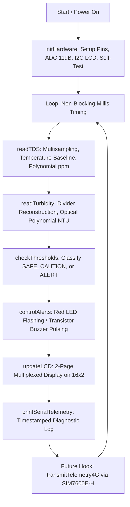

# IoT-Based Water-Quality Monitoring & Early-Warning System
## Hardware Implementation, Circuit Interfacing, Calibration, and Testing Protocol

---

## 1. Hardware Pin Definitions & Component Allocation

### Bill of Materials Utilization
All components specified in your hardware inventory are utilized with strict electrical safety:

| Component | Pin / Interface | Connected To ESP32 | Purpose & Electrical Safety Rationale |
| :--- | :--- | :--- | :--- |
| **ESP32 Dev Board** | USB Micro / Type-C | Laptop USB Port | 5V Power supply & Serial debugging at 115200 baud |
| **Analog TDS Module** | VCC, GND, AOUT | `3V3`, `GND`, `GPIO 34` (ADC1_CH6) | Powered from **3.3V rail** so its maximum analog output voltage never exceeds ~2.3V, safely protecting the ESP32 ADC pin. |
| **Turbidity Sensor Module** | VCC, GND, AOUT | `VIN (5V)`, `GND`, `GPIO 35` (ADC1_CH7) via divider | Turbidity IR emitters need **5V (VIN)** to emit sufficient optical power. Because it outputs up to 4.5V, a **10 kΩ / 22 kΩ voltage divider** steps it down to $\le 3.09\text{ V}$. |
| **16×2 I2C LCD** | VCC, GND, SDA, SCL | `VIN (5V)`, `GND`, `GPIO 21` (SDA), `GPIO 22` (SCL) | Display quantitative metrics and system early-warning diagnostic screens. |
| **Red Warning LED** | Anode (+), Cathode (-) | `GPIO 25` via **220 Ω** resistor, `GND` | Visual indicator for elevated/critical contamination risks. |
| **Buzzer** | (+), (-) | `VIN (5V)`, 2N2222 Collector | Audible alarm. The ESP32 pin cannot sink/source buzzer current safely (~30–50mA); the transistor handles the load. |
| **2N2222 NPN Transistor** | Base, Collector, Emitter | Base via **1 kΩ** to `GPIO 19`, Emitter to `GND`, Collector to Buzzer (-) | Switched low-side driver for the buzzer. |
| **Resistor: 220 Ω** | In series with Red LED | `GPIO 25` $\to$ 220 Ω $\to$ LED Anode | Limits LED forward current to safe $\approx 7\text{ mA}$. |
| **Resistor: 1 kΩ** | In series with Transistor Base | `GPIO 19` $\to$ 1 kΩ $\to$ 2N2222 Base | Limits base current to $I_B \approx \frac{3.3 - 0.7}{1000} = 2.6\text{ mA}$, driving 2N2222 into full saturation. |
| **Resistor: 10 kΩ (R1)** | Voltage divider top arm | Sensor AOUT $\to$ R1 $\to$ GPIO 35 | Protects ESP32 GPIO 35 from overvoltage. |
| **Resistor: 22 kΩ (R2)** | Voltage divider bottom arm | GPIO 35 $\to$ R2 $\to$ GND | Divides voltage: $V_{ADC} = V_{OUT} \times \frac{22}{10 + 22} = 0.6875 \times V_{OUT}$. |

---

## 2. Circuit Schematic Details

### A. Turbidity Sensor Voltage Divider
Optical turbidity boards powered by 5V produce an analog output between **2.5V (dirty)** and **4.5V (crystal clear)**. Connecting 4.5V directly to an ESP32 ADC pin will burn the ADC channel (rated for 3.3V absolute max).

```
Turbidity Module AOUT (0 - 4.5V)
       │
      [ ] R1 (10 kΩ)
       │
       ├───────────────> ESP32 GPIO 35 (ADC1_CH7)  [Max Voltage = 4.5V * (22 / 32) = 3.09V]
       │
      [ ] R2 (22 kΩ)
       │
      GND (Common Ground)
```

In the Arduino code, the actual sensor output is reconstructed mathematically:
$$V_{\text{sensor}} = V_{\text{ADC}} \times \left(\frac{10\,\text{k}\Omega + 22\,\text{k}\Omega}{22\,\text{k}\Omega}\right) = V_{\text{ADC}} \times 1.4545$$

### B. Buzzer Driver Circuit (2N2222 NPN)
Connecting a buzzer directly to an ESP32 GPIO will draw excess current and can corrupt the internal power rail or damage the pin.

```
ESP32 VIN (5V from USB) ──────(+) Buzzer (-)
                                   │
                                   │ (Collector)
ESP32 GPIO 19 ──[ 1 kΩ ]──(Base) 2N2222
                                   │ (Emitter)
                                   └───> Common GND
```

---

## 3. Required Arduino IDE Libraries

Install these via **Sketch $\to$ Include Library $\to$ Manage Libraries...** (or press `Ctrl+Shift+I`):

1. **`LiquidCrystal I2C`** by Frank de Brabander (or Marco Schwartz)
   - Header: `<LiquidCrystal_I2C.h>`
   - Provides I2C control for standard 16x2 HD44780 LCD with PCF8574 I2C backpack.
2. **`Wire`** (Built into the ESP32 Arduino Core)
   - Header: `<Wire.h>`

*Note: For the ESP32 board support itself, ensure you have installed the `esp32` package by Espressif Systems via the Boards Manager.*

---

## 4. Software Architecture & Flow

The code in `WaterQualityNode.ino` is structured into clean functional units:



### Critical ESP32 ADC Considerations
1. **ADC Non-Linearity**: ESP32 successive-approximation ADCs (SAR) have non-linear response curves below ~0.1V and above ~2.8V. By using `analogReadMilliVolts()`, the code queries internal eFuse factory calibration curves rather than raw uncalibrated counts.
2. **WiFi Interference Immunity**: Only **ADC1** pins (GPIO 32–39) are used (`GPIO 34` for TDS, `GPIO 35` for Turbidity). ADC2 pins (GPIO 0, 2, 4, 12-15, 25-27) fail whenever WiFi/Bluetooth is active. Reserving ADC1 ensures full compatibility with future 4G/WiFi expansion.

---

## 5. Sensor Limitations & Real-World Calibration Requirements

### What TDS and Turbidity Actually Measure
- **TDS (Total Dissolved Solids)**: Measures the electrical conductivity of dissolved ionic minerals (calcium, magnesium, chloride, sodium, carbonates).
- **Turbidity**: Measures light scattering caused by suspended solids (silt, clay, organic matter, algae).

### What They Do NOT Measure (Scientific Honesty for Project Presentation)
> [!IMPORTANT]
> **TDS and turbidity sensors CANNOT detect pathogens, viruses, or bacteria (such as *E. coli*, *Vibrio cholerae*, or Salmonella).**
> Water can be crystal clear (0 NTU) and low TDS (< 100 ppm) while containing lethal bacterial or viral loads. Conversely, high TDS can simply mean mineral-rich groundwater that is safe to drink. These sensors serve as **early physical-chemical screening indicators** (e.g., detecting sudden runoff, pipe breakage, silt infiltration, or salinization), not conclusive medical-grade drinking water certifications.

### Calibration Procedure
1. **TDS Calibration**:
   - Immerse the probe in a standard calibration buffer (e.g., 1413 µS/cm or 707 ppm NaCl solution).
   - Adjust `TDS_CALIBRATION_FACTOR` in code until readings match the buffer solution.
   - Clean the probe with deionized/distilled water between tests.
2. **Turbidity Calibration**:
   - Turbidity modules vary significantly due to photodiode manufacturing tolerances and supply ripple.
   - Place the probe in distilled water (0 NTU reference) and record the raw voltage.
   - Test in a 100 NTU Formazin standard or calibrate the voltage inflection threshold `if (sensorVoltage >= 4.10f)`.

---

## 6. Step-by-Step Testing Procedure

Follow this systematic testing sequence. Test each sub-circuit independently on the breadboard before loading the complete integrated software.

### Step 1: LCD & I2C Bus Verification
1. Connect LCD GND to ESP32 GND, VCC to VIN, SDA to GPIO 21, SCL to GPIO 22.
2. Upload an I2C scanner sketch or verify address. Standard address is `0x27` (some backpacks use `0x3F`).
3. If text is faint or invisible, adjust the blue contrast potentiometer on the back of the I2C backpack using a small screwdriver.

### Step 2: Red LED & Buzzer Transistor Driver Test
1. Connect the Red LED through the 220 Ω resistor to GPIO 25.
2. Connect the 2N2222 transistor:
   - Base $\to$ 1 kΩ $\to$ GPIO 19.
   - Collector $\to$ Buzzer negative pin.
   - Emitter $\to$ ESP32 GND.
   - Buzzer positive pin $\to$ ESP32 VIN (5V).
3. Verify that when the ESP32 boots, the startup self-test produces a quick 120 ms chirp and flash.

### Step 3: TDS Sensor Bench Test
1. Connect TDS VCC to ESP32 **3V3**, GND to GND, AOUT to GPIO 34.
2. In air (dry probe): Voltage should read close to 0.0V (0 ppm).
3. In clean tap water: Should read between 100 and 400 ppm depending on local water hardness.
4. Add a pinch of table salt (NaCl): Watch TDS reading immediately spike to 800+ ppm and trigger the warning system.

### Step 4: Turbidity Sensor Bench Test
1. Connect Turbidity module to 5V (VIN), GND to GND, and run AOUT through the 10k/22k divider to GPIO 35.
2. In clean, clear water: Sensor output voltage should be high (~3.8V – 4.2V prior to divider, ~2.6V – 2.9V at GPIO 35), yielding ~0 to 1 NTU.
3. Stir a drop of milk or silt into the water: Suspended particles will scatter the light beam, causing the sensor voltage to drop below 3.0V, triggering the NTU alarm threshold.

---

## 7. Roadmap: Future Expansion to SIM7600E-H 4G & Cloud Dashboard

When transitioning to the complete rural early-warning deployment:

1. **Hardware Interfacing (SIM7600E-H)**:
   - Connect module UART (`TX` $\to$ ESP32 GPIO 16 `RX2`, `RX` $\to$ ESP32 GPIO 17 `TX2`).
   - Use an external 5V/2A power supply (USB laptop power will brown out during 4G LTE transmission bursts).
2. **Telemetry Protocols**:
   - Implement MQTT client over cellular (e.g., using `TinyGSM` library) to publish JSON payloads:
     ```json
     {"station_id":"VILLAGE_WELL_04","tds_ppm":420,"turb_ntu":3.2,"status":"CAUTION"}
     ```
   - Automatically trigger emergency SMS alerts via standard GSM `AT+CMGS` commands when `status == STATUS_ALERT` directly to the local water committee or panchayat authorities.
3. **Cloud Dashboard**:
   - Ingest data into an open-source dashboard (e.g., ThingsBoard, Node-RED, or Grafana) for historical trend tracking, seasonal runoff correlation, and predictive contamination warnings.
